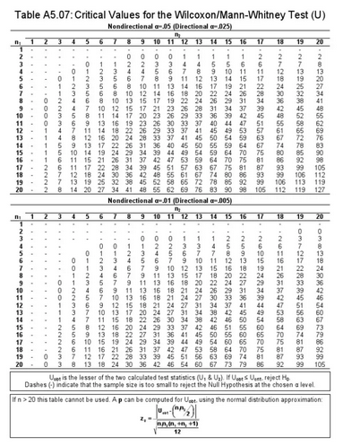

Sadrzaj:
* [Formule](#formule)
* [Termini](#termini)
* [Testovi](#testovi)
  * [Zakljucivanje](#zakljucivanje)
  * [t-testovi](#t-testovi)
    * [Studentov t-test](#studentov-t-test)
    * [Nezavisni t-test](#nezavisni-t-test)
    * [Upareni t-test](#upareni-t-test)
    * [Man-Vitnijev test](#man-vitnijev-test)
    * [Vilkoksonov test](#vilkoksonov-test)
  * [Vise od 2 grupe](#vise-od-2-grupe)
    * [ANOVA](#anova)
    * [Kruskal-Volisov test](#kruskal-volisov-test)
  * [Pomocni testovi](#pomocni-testovi)
    * [Levinov test](#levinov-test)

---    

# Formule

| Oznaka          | Opis                                        | Formula                                                               |
|:---------------:|:-------------------------------------------:|:---------------------------------------------------------------------:|
| $n$             | obim uzorka                                 |                                                                       |
| $m$             | aritmeticka sredina                         |                                                                       |
| $M$             | medijana                                    |                                                                       |
| $\bar{X_{n}}$   | srednju vrednost uzorka                     | $\displaystyle\frac {1} {n} \sum_{i=1}^n {X_{i}}$                     |
| $\bar{S_{n}}$   | uzoracka standardna devijacija (odstupanje) | $\sqrt {\bar{S_{n}^2}}$                                               |
| $\bar{S_{n}^2}$ | disperzija uzorka                           | $\displaystyle\frac {1} {n} \sum_{i=1}^n {(X_{i} - \bar{X_{n}})^2}$   |
| $\hat{S_{n}^2}$ | korigovana disperzija uzorka                | $\displaystyle\frac {1} {n-1} \sum_{i=1}^n {(X_{i} - \bar{X_{n}})^2}$ |

# Termini

| Termin | Opis |
|:---------------:|:----------------:|
| Stepen slobode | koristimo kao parametar pri citanju vrednosti granice kriticnog regionana osnovu vrednosti test statistike |

# Testovi

Pri testiranju imamo sledece vrednosti:
* `p-value`: opisuje statisticki znacaj dobijenog zakljucka
  * ovako se obicno i oznacava
  * dobija se kao rezultat testa u R-u
  * na osnovu poredjenja sa alfa (nivo znacajnosti) biramo odgovarajucu hipotezu
* `vrednost test statistike`: broj koji predstavlja rezultat test statistike
  * koristimo je kada rucno vrsimo racun
  * proverava se da li se nalazi u kriticnom regionu i na osnovu toga biramo hipotezu
* `vrednost za odgovarajucu tehniku`: vrednost koja predstavlja neku osobinu ili zakljucak
  * koristimo je nakon sto zakljuckom testa potvrdimo da postoji ta neka osobina
  * primer: korelacija izmedju neka 2 obelezja

## Zakljucivanje

Zakljucivanje (R testovi):
1. Izbor testa
2. Odredjivanje $\alpha$
   * ako nije navedemo, koristimo vrednost `0.05`
3. Izbor alternativne hipoteze
4. Vrsimo test
5. Poredimo p-value i $\alpha$
   * ako je $\text{p-value} > \alpha$, prihvatamo $H_{0}$
   * ako je $\text{p-value} \le \alpha$, prihvatamo $H_{1}$

---
   
Zakljucivanje (rucno testiranje):
1. Izbor testa
2. Odredjivanje $\alpha$
   * ako nije navedemo, koristimo vrednost `0.05`
3. Izbor alternativne hipoteze
4. Racunamo **test statistiku**
5. Proveravamo da li vrednost test statistike (oznacene kao `t`), upada u kriticni region (oznacen sa `C`)
   * ako je $t \notin C$, prihvatamo $H_{0}$
   * ako je $t \in C$, prihvatamo $H_{1}$

## t-testovi

### Studentov t-test

* Parametarski test.
* Testira da li je sredina populacije neki odredjeni broj

---

#### Uslovi
* 1 neprekidno obelezje jednog uzorka
* posmatrano obelezje ima normalnu raspodelu

---

#### Nulta hipoteza

Sredine je (jednaka vrednosti) $m_{0}$:

$$
H_{0}(m=m_{0})
$$

---

#### Test statistika

$$
t_{n-1} = \frac {\bar{x_{n}} - m_{0}} {\displaystyle\frac {\hat{S_{n}}} {\sqrt{n}}}
$$

Ima [Studentovu $t$ raspodelu](slike/studentova-raspodela.png) sa $n-1$ stepenom slobode.

---

|  Kriticna oblast                                                   | Alternativna hipoteza |
|:------------------------------------------------------------------:|:---------------------:|
| $C = (- \infty, -t_{n-1, \alpha}) \cup (t_{n-1, \alpha}, +\infty)$ | $H_{1}(m \ne 0)$      |
| $C = (t_{n-1, 2\alpha}, +\infty)$                                  | $H_{1}(m > 0)$        |
| $C = (- \infty, -t_{n-1, 2\alpha})$                                | $H_{1}(m < 0)$        |

### Nezavisni t-test

* parametarska alternativa za [Man-Vitnijev test](#man-vitnijev-test)
* testira da li postoji razlika izmedju 2 populacije (jednake sredine) za dato obelezje

---

#### Uslovi
* **po** 1 neprekidno obelezje iz 2 uzorka/populacije/grupe
* posmatrano obelezje **ima** normalnu raspodelu
* **(opciono, ali pozeljno)** homogenost varijanse

---

#### Nulta hipoteza 

Sredine u obe grupe su jednake:

$$
\begin{gather*}
H_{0}(m = 0) \\
ili \\
H_{0}(m_{1} = m_{2})
\end{gather*}
$$

gde je $m_{1}$ sredina jednog uzorka, a $m_{2}$ sredina drugog, a $m = m_{1} - m_{2}$.

---

#### Test statistika

$$
t = 
\frac 
    {\bar{X_{n_{1}}} - \bar{X_{n_{2}}}}
    {\displaystyle\sqrt {
      \displaystyle\frac {(n_{1}-1)\hat{S_{1}^2} + (n_{2}-1)\hat{S_{2}^2}} {n_{1}+n_{2}-2} 
      \left(\frac {1} {n_{1}} + \frac {1} {n_{2}}\right)
      }
    }
$$

Ima [Studentovu $t$ raspodelu](slike/studentova-raspodela.png) sa $n_{1} + n_{2} - 2$ stepenom slobode.

---

|  Kriticna oblast                                                   | Alternativna hipoteza |
|:------------------------------------------------------------------:|:---------------------:|
| $C = (- \infty, -t_{n_{1} + n_{2} - 2, \alpha}) \cup (t_{n_{1} + n_{2} - 2, \alpha}, +\infty)$ | $H_{1}(m \ne 0)$      |
| $C = (t_{n_{1} + n_{2} - 2, 2\alpha}, +\infty)$                                  | $H_{1}(m > 0)$        |
| $C = (- \infty, -t_{n_{1} + n_{2} - 2, 2\alpha})$                                | $H_{1}(m < 0)$        |

### Upareni t-test

* parametarska alternativa za [Vilkoksonov test](#vilkoksonov-test)
* testira da li postoji razlika izmedju 2 merenja (jednake sredine) za dato obelezje

---

#### Uslovi
* 2 merenja nad **istom** populacijom
* 1 neprekidno obelezje u oba merenju
* obelezje ima **normalnu raspodelu** u **oba** merenja

---

#### Nulta hipoteza

Sredina u prvom merenju je jednaka sredinu u drugom (sredine u merenjima 
su jednake):

$$
\begin{gather*}
H_{0}(D=0) \\
ili \\
H_{0}(m_{1} = m_{2})
\end{gather*}
$$

$D = m_{1} - m_{2}$ uvedena nova oznaka radi izbegavanja preklapanja oznaka

---

#### Test statistika

$$
t_{n-1} = \frac {\bar{D_{n}}} {\displaystyle\frac {\hat{S_{n}}} {\sqrt{n}}} 
$$

Ima [Studentovu $t$ raspodelu](slike/studentova-raspodela.png) sa $n - 1$ stepenom slobode.

---

|  Kriticna oblast                                                   | Alternativna hipoteza |
|:------------------------------------------------------------------:|:---------------------:|
| $C = (- \infty, -t_{n-1, \alpha}) \cup (t_{n-1, \alpha}, +\infty)$ | $H_{1}(m \ne 0)$      |
| $C = (t_{n-1, 2\alpha}, +\infty)$                                  | $H_{1}(m > 0)$        |
| $C = (- \infty, -t_{n-1, 2\alpha})$                                | $H_{1}(m < 0)$        |

### Man-Vitnijev test

* neparametarska alternativa za [Nezavisni t-test](#nezavisni-t-test)
* testira da li postoji razlika izmedju 2 populacije (jednake medijane) za dato obelezje

---

#### Uslovi
* **po** 1 neprekidno obelezje iz 2 uzorka/populacije/grupe
---

#### Nulta hipoteza 

Nema razlike izmedju medijana:

$$
\begin{gather*}
H_{0}(M = 0) \\
ili \\
H_{0}(M_{1} = M_{2})
\end{gather*}
$$

gde je $M_{1}$ medijana jednog uzorka, a $M_{2}$ medijana drugog, a $M = M_{1} - M_{2}$.

---

#### Test statistika

$$
T_{n_{1}} = \displaystyle\sum_{k=1}^{n_1} r_{x_{k}}
$$

gde je $(x_{1}, x_{2}, \dots,  x_{n_{1}})$ uzorak koji ima **manji obim**, 
$n_{1}$ njegov obim, a $r_{k}$ rang `k`. clana tog uzorka.

---

|  Kriticna oblast                                                 | Alternativna hipoteza |
|:----------------------------------------------------------------:|:---------------------:|
| $C = (0, T_{n_{1}, n_{2}}^a) \cup (T_{n_{1}, n_{2}}^b, +\infty)$ | $H_{1}(M \ne 0)$      |

---

#### Test

Tabela:

### Vilkoksonov test

* neparametarska alternativa za [Upareni t-test](#upareni-t-test)
* testira da li postoji razlika izmedju 2 merenja (jednake medijane) za dato obelezje
* https://www.statology.org/wilcoxon-signed-rank-test
  * **Napomena**: za igrace 1, 8, 10, 11 i 15 je `3` zato sto 
  je to vrednost proseka njihovih pozicija u varijacionom nizu, tj.
  `suma = 3+4+5+6+7 = 15`, `n = 5`, pa je `rank = suma/n = 15/5 = 3`
---

#### Uslovi
* 2 merenja nad **istom** populacijom
* **po** 1 neprekidno obelezje iz 2 merenja

#### Nulta hipoteza 

Medijane su po merenjima jednake:

$$
H_{0}(M=0)
$$

---

#### Test statistika

$$
T_{n,\alpha}=\min\left(\sum{\text{pozitivni rangovi}} ,  \left| \sum{\text{negativni rangovi}} \right| \right)
$$

---

|  Kriticna oblast                                                 | Alternativna hipoteza |
|:----------------------------------------------------------------:|:---------------------:|
| $C = (-\infty, T_{n, \alpha}]$ | $H_{1}(M \ne 0)$ |

#### Test

1. rangiranje apsolutnih vrednosti razlika
2. rangu se dodeljuje znak razlike
3. sabiranje posebno pozitivnih i negativnih rangova (2 sume)
4. test statistika: $\min\left(\sum{\text{pozitivni rangovi}} \;  \left| \sum{\text{negativni rangovi}} \right| \right)$
5. granice za kriticni region se citaju iz tablice koja je predvidjena za ovaj test
6. prihvatanje neke hipoteze

Ako imamo iste vrednosti, njihov rang predstavlja prosek njihovih
pozicija u var. nizu.

Ako nema promena (razlika 0), onda se dati element ne posmatra
dalje u algoritmu i ne racuna u ukupan broj elemenata (`n` ce se smanjiti
onoliko koliko ima ovakvih elemenata).

## Vise od 2 grupe

### ANOVA

### Kruskal-Volisov test

* neparametarska alternativa za [ANOVA-u](#ANOVA)
* testira da li postoji razlika po datum obelezju
  u tri ili vise grupe

---

#### Uslovi
* **po** 1 neprekidno obelezje iz 3 grupe ili vise grupe

---

#### Nulta hipoteza

Medijane po brupama jednake:

$$
H_{0}(M_1 = M_2 = M_3 = \dots = M_n)
$$

---

#### Test statistika

$$
H = \frac{12}{n(n+1)} \displaystyle\sum_{i=1}^{k} \frac{R_{i}^2}{n_{i}} - 3 (n+1)
$$

Ima [$\chi^2$ (hi kvadrat) raspodelu](slike/hi-kvadrat.png).

---

|  Kriticna oblast                                                   | Alternativna hipoteza |
|:------------------------------------------------------------------:|:---------------------:|
| $C = (- \infty, -t_{n-1, \alpha}) \cup (t_{n-1, \alpha}, +\infty)$ | $H_{1}(m \ne 0)$      |

## Pomocni testovi

### Levinov test

* ispituje homogenost varijansi
* koristi se pri izboru nezavisnog t-testa

#### Nulta hipoteza

Varijanse su jednake u obe populacije:

$$
H_{0}(\sigma_{1}^2 = \sigma_{2}^2)
$$
